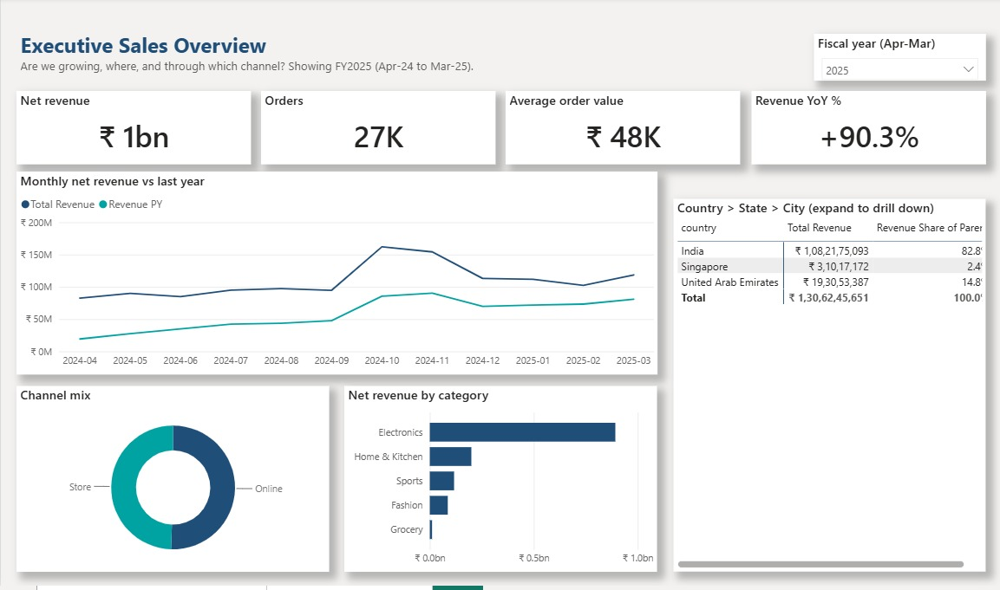
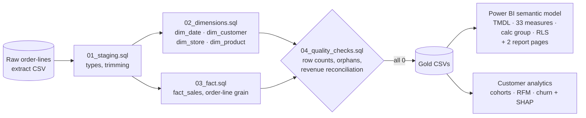
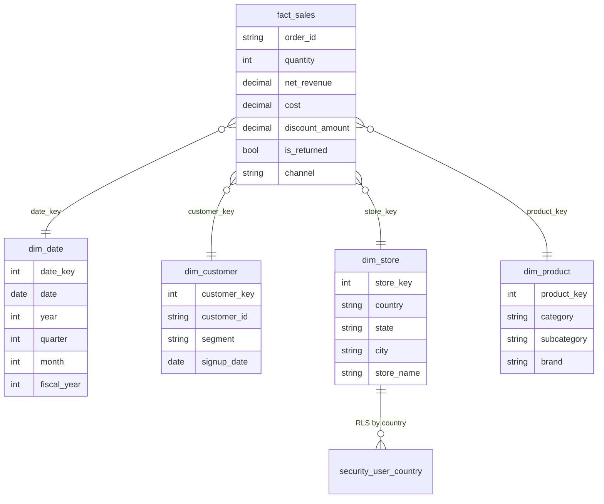
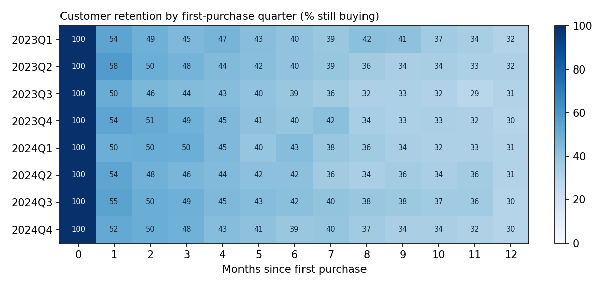
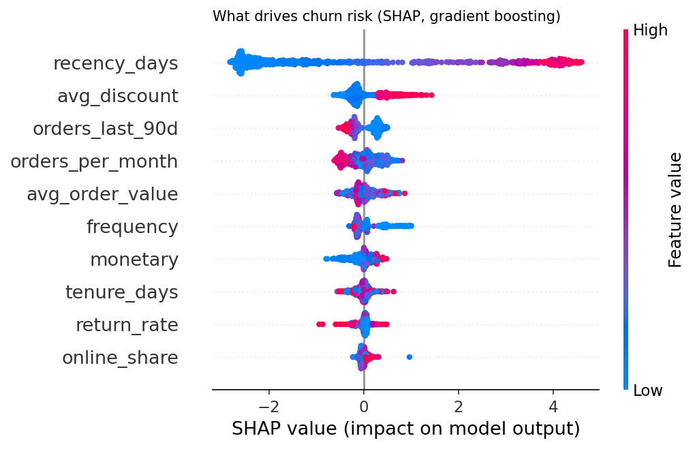

# Sales Intelligence: Power BI + SQL + Customer Analytics

**End-to-end retail analytics: a SQL-built star schema, a source-controlled Power BI project (TMDL model with 33 DAX measures, time-intelligence calculation group and dynamic RLS, plus two report pages generated from code), and customer analytics (cohorts, RFM, churn prediction with SHAP).**



[](https://github.com/Shashan4321/sales-intelligence-powerbi/actions/workflows/ci.yml)


> **Business problem.** Regional and category managers need one trusted view of sales (Country → State → City → Store, YoY/MoM/YTD, Indian FY) with each manager seeing only their own country, and they need to know *which customers are about to stop buying* so retention budget goes to the right people.

| | |
|---|---|
| **Stack** | SQL (DuckDB) · Power BI (PBIP/TMDL, DAX, Power Query M, RLS, calculation groups) · Python (pandas, scikit-learn, SHAP) · pytest · sqlfluff · GitHub Actions |
| **Skills shown** | Dimensional modelling · ETL · data-quality checks · DAX time intelligence · row-level security · Power BI in Git · cohort & RFM analysis · churn modelling & explainability |
| **Data** | Synthetic retail order lines, 147,754 lines / 5,000 customers / 2023-2025 (see [Data & license](#data--license)) |

## Architecture



### Star schema



## Power BI semantic model (PBIP / TMDL)

The model is stored as text in [`powerbi/SalesIntelligence.SemanticModel`](powerbi/SalesIntelligence.SemanticModel/definition), so every measure change shows up as a readable diff in a pull request. No `.pbix` and no real data are committed.

| Area | What's in it |
|---|---|
| **Sales measures (26)** | Revenue, cost, margin %, orders, AOV, units, return rate, discount %, active & new customers, revenue per customer. Full list with DAX: [`docs/dax_measures.md`](docs/dax_measures.md) |
| **Churn measures (7)** | Customers scored, high-risk count and %, average churn probability, observed churn %, revenue at risk, cohort retention % (tables `customer_scores` and `cohort_retention`, exported by `make customers`) |
| **Time intelligence** | PY, YoY %, PM, MoM %, MTD, QTD, YTD, **FYTD (Indian FY, April-March)**, running total, 3-month rolling average |
| **Calculation group** | `Time Intelligence`: Current / PY / YoY / YoY % / MTD / QTD / YTD / FYTD, applied to any measure |
| **Ranking & drill-down** | Category and city rank, dynamic Top N (what-if parameter), share of parent across the **Country → State → City → Store** hierarchy |
| **Row-level security** | `Country Manager` (dynamic: `USERPRINCIPALNAME()` mapped to countries) and `India Only` (static) |
| **Hierarchies** | Geography, Calendar, Product |

```dax
Revenue YoY % =
VAR _cur = [Total Revenue]
VAR _py = [Revenue PY]
RETURN
    IF ( NOT ISBLANK ( _py ), DIVIDE ( _cur - _py, _py ) )

Revenue FYTD = TOTALYTD ( [Total Revenue], dim_date[date], "31/3" )   -- Indian FY
```

**Validating the DAX.** [`reports/expected_measure_values.md`](reports/expected_measure_values.md) lists the value each measure should show for a given filter, computed independently in SQL (e.g. Total Revenue 2025 = ₹1,584,825,489; YoY = 32.1%; FYTD FY2025 = ₹1,306,245,651). Put the measure on a card with the same filter; the numbers must match.

## Power BI report

Two pages, refreshed in Power BI Desktop from the gold CSVs. The layout is generated from code by [`powerbi/build_report.py`](powerbi/build_report.py), so it is reviewable in a diff, and a test checks that every field a visual uses exists in the model. The colours come from the portfolio theme in [`powerbi/theme`](powerbi/theme).

**Executive Sales Overview** (screenshot above): fiscal-year slicer (FY2025 selected), net revenue, orders, AOV and YoY cards, monthly revenue vs last year, Country → State → City matrix with share of parent, channel mix and revenue by category.

**Customer Churn**: customers scored at the 30-Jun-2025 snapshot, high-risk share, revenue at risk (12-month spend of high-risk customers), observed churn, customers by risk band, churn by RFM segment, cohort retention heatmap and the highest-risk customers.


**Checked against SQL.** FY2025 net revenue on the report, ₹1,30,62,45,651, is exactly the SQL-computed FYTD FY2025 value in [`reports/expected_measure_values.md`](reports/expected_measure_values.md). Of the customers the model rates *High* risk, 95% did not buy again in Jul-Dec 2025, against 6% of *Low* risk customers. These scores include the model's own training customers, so read them as a ranking check, not as test accuracy (test-set results are in the churn table below).

**Open it:** run `make all`, then open `powerbi/SalesIntelligence.pbip` in Power BI Desktop and click **Refresh**. The `DataFolder` parameter defaults to `C:\sales-intelligence-powerbi\data\gold\`; change it under *Transform data → Edit parameters* if your gold CSVs are elsewhere. To change the layout, edit `build_report.py` and run `python powerbi/build_report.py` with Power BI Desktop closed.

## Customer analytics

### Cohort retention



Roughly half of each quarter's new customers buy again the next month, and about 30-32% are still buying 12 months later. The pattern is stable across cohorts, so retention is driven by customer behaviour, not by when they joined.

### Churn model

Snapshot 30-Jun-2025, customers active in the previous 365 days (3,077). *Churned* = no purchase in the next 6 months. Baseline churn rate: **43.2%**. Test set: 770 customers.

| Model | ROC-AUC | PR-AUC | Churn rate in top-20% risk | Lift |
|---|---:|---:|---:|---:|
| Logistic regression | 0.919 | 0.925 | 100% | 2.31× |
| Gradient boosting | 0.923 | 0.927 | 100% | 2.31× |



**What drives churn:** recency dominates, then a high average discount (deal-seekers leave sooner), then low recent and overall order frequency.

**Recommendation.** The simple logistic regression is almost as good as gradient boosting, so use it in production: it is easier to explain to the business. Send retention offers to the top-20% risk list, and do not answer churn risk with deeper discounts, because heavy discounting is itself a churn driver.

> *Honest caveat:* the data is simulated with known churn behaviour, so these scores are higher than you should expect on real customers. The value here is the method: leakage-safe snapshot features, a documented churn definition, baseline vs complex model, explainability, and an action list.

### RFM segments (same snapshot)

| Segment | Customers | Churned in next 6 months |
|---|---:|---:|
| Champions | 888 | 5.7% |
| Promising | 571 | 16.5% |
| Needs attention | 79 | 12.7% |
| At risk | 571 | 67.6% |
| Hibernating | 968 | 81.4% |

## Quick start

```bash
git clone https://github.com/Shashan4321/sales-intelligence-powerbi.git
cd sales-intelligence-powerbi
pip install -r requirements-dev.txt
make all     # generate -> SQL ETL + quality checks -> customer analytics -> expected DAX values
make test    # 10 tests: quality checks, grain, TMDL-vs-data consistency, churn model, report layout
make lint    # ruff + sqlfluff
```

## Project structure

```text
├── sql/                               # 01 staging, 02 dimensions, 03 fact, 04 quality checks
├── src/salesintel/
│   ├── generate.py                    # seeded raw extract with simulated customer behaviour
│   ├── etl.py                         # runs the SQL, fails on any quality check, exports gold
│   ├── customers.py                   # cohorts, RFM, churn model, SHAP
│   └── expected.py                    # SQL-computed expected values for the DAX measures
├── powerbi/
│   ├── SalesIntelligence.pbip
│   ├── build_report.py                # generates the two report pages (report.json)
│   ├── theme/portfolio-theme.json
│   ├── SalesIntelligence.Report/      # report pages + registered theme
│   └── SalesIntelligence.SemanticModel/definition/
│       ├── tables/*.tmdl              # columns, 33 measures, churn scores, Top N, calculation group
│       ├── relationships.tmdl
│       └── roles/*.tmdl               # dynamic + static RLS
├── docs/dax_measures.md               # every measure with DAX + description
├── reports/                           # expected measure values, churn results (JSON)
└── tests/                             # incl. "every TMDL column exists in the gold data"
```

## Data & license

* **Data:** 100% synthetic, generated by [`generate.py`](src/salesintel/generate.py) (NumPy, seed 2024). Store, product and customer names are invented; RLS e-mails use `example.com`. No employer or client data, schema, screenshots or code are used.
* **Code:** MIT License.

## Author

**Shashank Singh**, Senior Data Analyst / Power BI Developer · [Portfolio](https://shashan4321.github.io) · [LinkedIn](https://www.linkedin.com/in/shashank-moon)

*Professional impact:* built 10+ enterprise Power BI dashboards (star/snowflake schemas, DAX, RLS, drill-through, time intelligence) for 50+ stakeholders and cut reporting time by about 50%. This repo shows the same techniques on open, synthetic data.
